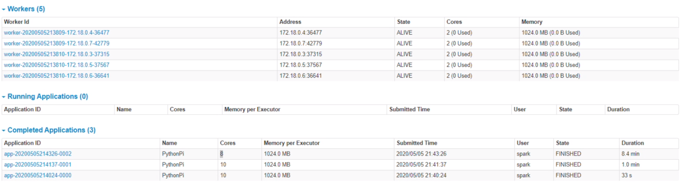

# Apache Spark Cluster menggunakan docker

## Percobaan
Percobaaan dilakukan pada windows dengan menggunakan Docker versi windows.
Percobaan dilakukan degnan mengubah jumlah worker, jumlah core pada tiap worker dan pengubahan parameter partisi.   
Tampilan web apache spark pada akhir percobaan untuk masing-masing pengaturan jumlah worker dan core adalah sebagai berikut:  
-  Worker 2 Core 2
-  Worker 2 Core 4
-  Worker 5 Core 2
-  Worker 5 Core 4

Pada percobaan, ditemukan bahwa menggunakan core diatas 2 dengan jumlah worker 5 selalu menyebabkan error(error dimulai saat paramater diatur ke 1000). Kemungkinan besar error ini disebabkan oleh kurang kuatnya kekuatan komputasi perangkat keras yang dipakai.

Tabel lengkapnya adalah sebagai berikut

| No | Worker | CPU/Worker | Partition | Pi Value | Time   |
|----|--------|------------|-----------|----------|--------|
| 1  | 2      | 2          | 100       | 3.1362   | 19s    |
| 2  | 2      | 2          | 1000      | 3.142527 | 1.5min |
| 3  | 2      | 4          | 100       | 3.141234 | 17s    |
| 4  | 2      | 4          | 1000      | 3.13938  | 1.5min |
| 5  | 5      | 2          | 100       | 3.145201 | 33s    |
| 6  | 5      | 2          | 1000      | error    | 8.4min |
| 7  | 5      | 4          | 100       | error    | 3.4min |
| 8  | 5      | 4          | 1000      | error    | 8.9min |

## Kesimpulan
Penambahan worker atau partition secara umum memperlama waktu yang dibutuhkan untuk pemrosesan. Tidak hanya memperlama, penambahan tersebut juga bisa meningkatkan kemungkinan error/crash, ini juga bisa disebabkan oleh masalah teknis dari perangkat keras yang digunakan. 